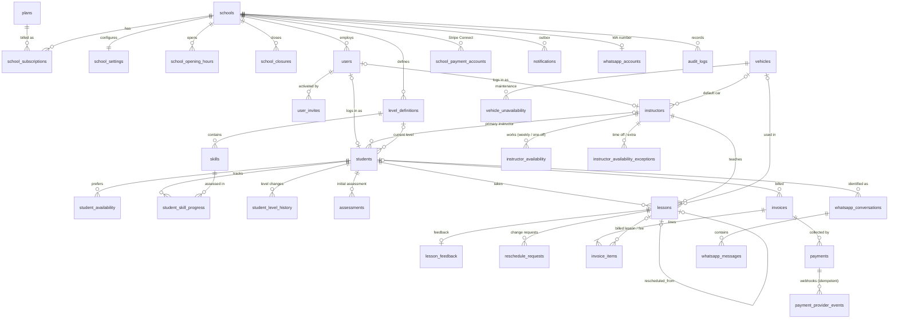

# Architecture

DriveDesk is a multi-tenant SaaS for driving schools: students, instructors, vehicles, lessons, progress, payments, e-mail, and a WhatsApp AI assistant. It is built for a one-person school first, and scales to multi-instructor schools without changes.

**Stack:** Next.js 15 (App Router, server components and server actions) · TypeScript · PostgreSQL 16 (`pg`, hand-written SQL) · Stripe · Resend · Meta WhatsApp Cloud API · Claude (`@anthropic-ai/sdk`) · Luxon for timezones · Vitest.

```
src/
  lib/                 env, db (withTenant / withPlatform), crypto, rbac, time, errors
  server/
    auth/              session cookie (JWT) + actor resolution
    policies.ts        24h reschedule / cancellation rules (pure)
    scheduling/        engine.ts (pure slot finder), intervals.ts, loader.ts (DB -> engine)
    services/          lessons, billing, students, progress, assessments, schools, staff, auth, audit, notifications
    payments/          provider interface, Stripe provider, /pay link resolution, webhook routing
    email/             provider interface (Resend / console), templates
    whatsapp/          webhook verify+parse, Cloud API client, inbound pipeline
    agent/             Claude tool loop, tools, prompt
    jobs/              outbox delivery, reminders, overdue payments
  app/                 UI + route handlers (webhooks, cron, JSON API, /pay)
db/migrations/         SQL schema (RLS, constraints)
tests/unit, tests/integration
```

---

## 1. Multi-tenancy decision

**Chosen: a shared schema with `school_id` on every tenant table, plus PostgreSQL Row Level Security (FORCE'd), plus composite foreign keys.**

| Option | Verdict |
|---|---|
| `school_id` column only (app filters) | Simple, but one forgotten `WHERE school_id = …` leaks data. Not enough on its own. |
| **`school_id` + RLS** ✅ | One schema and one migration path. The database refuses cross-tenant reads and writes even when application code has a bug. Cheap for thousands of small tenants. |
| Schema per tenant | Strong isolation, but N× migrations, connection/`search_path` juggling, and cross-tenant reporting is awkward. Poor fit for many tiny schools. |
| Database per tenant | Strongest isolation, highest cost and operational overhead. Only worth it for enterprise tenants with contractual requirements; it can be added later for one tenant without changing the code, because the code is already tenant-scoped. |

How it is enforced (`db/migrations/001_core_schema.sql`, `src/lib/db.ts`):

1. **Tenant context per transaction.** Every request on behalf of a school user runs in `withTenant(schoolId, fn)`. That opens a transaction and runs `set_config('app.school_id', …, true)`. Because the setting is transaction-local, it can never leak to another request that reuses a pooled connection.
2. **RLS on every tenant table**, `ENABLE` + `FORCE`: `USING (school_id = app_current_school_id()) WITH CHECK (same)`. When no context is set, `app_current_school_id()` is NULL, so every query returns **zero rows** (fail closed). A test covers this.
3. **Two database roles.**
   - `dsa_app` is used for all user traffic and is subject to RLS. It is never a superuser or the table owner.
   - `dsa_platform` has BYPASSRLS. It is used only for the SaaS-admin console, login lookup (the school isn't known yet), routing inbound webhooks (WhatsApp `phone_number_id` → school, Stripe metadata → school), and system jobs.
4. **Composite foreign keys.** Every table has `UNIQUE (school_id, id)`, and references use `FOREIGN KEY (school_id, student_id) REFERENCES students (school_id, id)`. A School A lesson therefore cannot point at a School B student, instructor, vehicle or level, even with a valid UUID.
5. **Grants.** `audit_logs` is append-only (UPDATE/DELETE revoked). Tenants cannot insert or delete `schools` rows, and can only update the profile columns.

`tests/integration/tenant-isolation.test.ts` checks cross-tenant reads, cross-tenant writes, cross-tenant FK references, the no-context case and audit immutability.

---

## 2. Roles and access control

Role → permission matrix in `src/lib/rbac.ts`; services add **ownership** checks on top.

| Capability | SaaS admin | Owner | School admin | Instructor | Student |
|---|:-:|:-:|:-:|:-:|:-:|
| Manage schools, subscriptions, platform stats | ✅ | | | | |
| Settings, integrations (WhatsApp/Stripe) | | ✅ | | | |
| Students, instructors, vehicles, all lessons, payments, reports | | ✅ | ✅ | | |
| Review AI level assessments, WhatsApp inbox | | ✅ | ✅ | | |
| Own calendar: start/complete/cancel/reschedule, feedback, skills, level, request payment | | ✅* | ✅* | ✅ own | |
| Students they teach (primary instructor, or has a lesson with them) | | ✅ | ✅ | ✅ | |
| Own dashboard, level, feedback, lessons, payments, reschedule (24h rule), profile | | | | | ✅ |

\* Owners/admins can also teach: "I teach lessons myself" links their user to an instructor profile. This covers the one-person school.

Sessions are an HS256 JWT in an httpOnly cookie. On every request the user row is re-read, so disabled users and bumped `token_version` (revoke all sessions) take effect immediately. Passwords use scrypt. Invites and password setup use single-use, hashed, 7-day tokens.

---

## 3. Data model (ERD)

All tenant tables carry `school_id` (omitted from the diagram for readability). Money is integer cents plus an ISO currency code. Instants are `timestamptz`. Weekly rules are local `time`, interpreted in `schools.timezone`.



Key constraints:

| What | How |
|---|---|
| No double booking of instructor / vehicle / student | Three `EXCLUDE USING gist (… WITH =, during WITH &&) WHERE status NOT IN ('cancelled','rescheduled')` constraints on `lessons`. `during` is a generated `tstzrange`. Race-proof: of two concurrent transactions, one gets SQLSTATE 23P01, mapped to a friendly "slot taken" error. Tested with concurrent bookings. |
| Legal lesson status transitions | `BEFORE UPDATE` trigger (`scheduled → confirmed/in_progress/completed/cancelled/no_show/rescheduled`, …). |
| Bill a lesson once | `UNIQUE (lesson_id, kind)` on `invoice_items`. |
| Apply each provider webhook once | `UNIQUE (provider, event_id)` on `payment_provider_events`. |
| Apply each WhatsApp message once | `UNIQUE (wa_message_id)`. |
| One open reschedule request per lesson; one live replacement per lesson | Partial unique indexes. |
| Paid ⇔ `paid_at`, cancelled ⇔ `cancelled_at`, completed ⇒ `completed_at` | CHECK constraints. |
| WhatsApp number → one live student per school | Partial unique index on `(school_id, phone_e164)`. |
| AI assessment is a suggestion until reviewed | `assessments.status` (`suggested` → `confirmed`/`overridden` needs a reviewer and a final level). `students.level_confirmed = false` until then. |

Lesson numbers follow the chronological order of a student's live lessons (`renumberStudentLessons`), so booking an earlier slot later, or cancelling, keeps numbering right. A rescheduled lesson is kept as history (`status = 'rescheduled'`). The replacement points back via `rescheduled_from_id`.

---

## 4. Scheduling engine

`src/server/scheduling/engine.ts` is a pure function (no I/O), fully unit-tested. A slot is offered only when **all** of these hold:

- the school is open (weekly hours minus closure days);
- the instructor is available (weekly rules with validity ranges, plus one-off dates, plus "available" exceptions, minus "unavailable" exceptions) and qualified for the student's licence category;
- the instructor has no overlapping lesson (± buffer);
- a vehicle with the student's transmission and category is free (± buffer, minus maintenance windows), preferring the instructor's default car;
- the student has no overlapping lesson;
- it falls inside the student's preferred availability (when they set any);
- it starts at least `min_booking_lead_hours` from now and within `booking_horizon_days`.

All wall-clock logic runs in the school's IANA timezone, so DST is handled. Starts snap to a local grid (`slot_granularity_minutes`). Results can be deduped per start time and prefer the student's primary instructor.

Booking is **propose, then re-validate, then insert**. `bookLesson` locks the student row, re-runs the engine for exactly that slot inside the transaction (`revalidateSlot`), and inserts. The exclusion constraints are the final guard against races. Staff can override availability rules (e.g. an evening lesson) but never the no-double-booking constraints.

## 5. Rescheduling and the 24-hour rule

`src/server/policies.ts`: `noticeDeadline(start, hours, tz)` subtracts whole days as **calendar days in the school timezone**. "24h before a lesson at 15:00" is therefore 15:00 local the previous day, even across a DST change, and any remaining hours are subtracted as elapsed time. The rule is:

- evaluated with the **database clock** (`SELECT now()`) inside the transaction that changes the lesson, not the browser or app clock;
- enforced in `rescheduleLesson` / `cancelLesson` for student and AI-agent principals. The portal, the JSON API and WhatsApp all go through it. The UI only mirrors it (it hides the button and shows the deadline);
- configurable per school: `min_reschedule_notice_hours`, `min_cancellation_notice_hours`, `late_cancellation_fee_cents`. Staff and instructors may still move or cancel late; a staff late cancellation creates a fee invoice unless waived. Optional `reschedule_requires_approval` sends requests to an approval queue.

## 6. Payments

On completion (`completeLesson`), one transaction does all of this:

1. sets the lesson to `completed` and saves feedback, skills and level;
2. creates the invoice, invoice line and payment (`pending`, due in `payment_due_days`);
3. sets `lessons.payment_status = 'pending'`;
4. queues the "lesson completed – amount due" e-mail (outbox).

The e-mail links to a **stable capability URL** `/pay/<48-hex token>`. It creates a fresh Stripe Checkout Session when clicked (Stripe sessions expire; our link doesn't), with `metadata {school_id, payment_id}`, an idempotency key and, when configured, the school's Stripe Connect account.

**Only two things can mark a payment paid:**

- a verified webhook: signature checked, deduped by event id, amount and currency compared with what we expect, then payment, invoice and lesson updated, with a receipt e-mail and an audit row;
- an owner/admin recording a cash or bank payment, which is audited.

The Stripe success redirect page deliberately changes nothing. Refunds and async failures are mapped too. Overdue marking uses each school's local date. The provider layer is an interface (`PaymentProvider`: `createCheckout`, `verifyWebhook` → normalized event), so Mollie or Adyen can be added without touching business code.

## 7. E-mail

A transactional outbox. Services insert `notifications` rows in the same transaction as the business change, so a rollback sends nothing. The worker (`deliverNotifications`) claims rows with `FOR UPDATE SKIP LOCKED` (safe with several workers), renders a template, sends with a provider idempotency key, and retries with exponential backoff (max 5 attempts). It scrubs one-time secrets (activation links, codes) from the payload after sending. Dedupe keys make reminders and payment requests exactly-once.

Templates: welcome/activation, staff invite, booking confirmation, 24h reminder (per-school hours), rescheduled, cancelled, completed with payment request, late-cancellation fee, payment received, payment overdue, reschedule request received, WhatsApp handoff alert, WhatsApp verification code.

The provider sits behind `EmailProvider`, with Resend in production and a console provider in dev/tests.

## 8. WhatsApp and the AI assistant

The integration uses the official **Meta WhatsApp Cloud API** only.

**Pipeline** (`src/server/whatsapp/inbound.ts`):

1. `POST /api/webhooks/whatsapp` verifies `X-Hub-Signature-256` (HMAC with the app secret, constant time).
2. It routes the message by `phone_number_id` to the school, stores it idempotently (`wa_message_id`), and returns 200 fast.
3. After the response (`next/server` `after()`; the cron tick retries anything left `pending`), it:
   - takes a short **lease** on the conversation, so only one worker answers it at a time;
   - batches all pending messages;
   - identifies the contact by E.164 number, which gives a verified student or an unknown contact;
   - stays silent when the conversation is in human handoff or the school disabled the AI;
   - runs the agent, sends the reply, and logs the intent, AI response and tool trace per message, plus an audit row.

**Agent** (`src/server/agent/*`): a Claude tool-use loop (`claude-opus-5` by default via `AGENT_MODEL`), with adaptive thinking at `medium` effort for chat latency. The system prompt is prompt-cached. Server-side refusal fallback is on (`fallbacks: "default"`); a refusal becomes a polite handoff.

The model **never decides identity or business outcomes.** It only chooses which tool to call:

| Contact | Tools |
|---|---|
| Everyone | `record_intent`, `get_school_info`, `request_human` |
| Unknown number | `find_my_student_account` (e-mails a 6-digit code; no account enumeration), `verify_link_code` (5 attempts, 15 minutes, keyed hash), `register_new_student`, `submit_assessment` |
| Verified student | `get_my_lessons`, `get_my_payments` (pay links), `find_available_slots`, `propose_booking` / `propose_reschedule` / `propose_cancellation`, `confirm_pending_action`, `cancel_pending_action`, `submit_assessment` |

Safeguards:

- Every tool validates its input with zod.
- Tools run with an `ai_agent` principal bound to the conversation's **verified** student, through the same services as the web app. The 24h rule, double-booking protection and ownership checks all apply.
- The runner refuses tools not offered to this contact.
- Changes are two-step: `propose_*` stores a pending action, and `confirm_pending_action` fails unless the confirmation arrives in a **later** message than the proposal.
- Offered slots are stored server-side under labels (A–F), so the model cannot invent an instructor, car or time.

**New-student flow:** the assistant collects name, phone (defaults to the WhatsApp number), e-mail, licence category, transmission, experience and preferred times, then registers a `lead`. It then asks the short assessment. `submit_assessment` scores it **deterministically** (`assessment-scoring.ts`: bands beginner/basic/intermediate/advanced, with safety caps, confidence capped at 0.85, and a rationale). It stores answers, band, level, confidence and timestamp. The assistant presents the result as a suggestion ("an instructor will confirm this during your first lesson"). Staff confirm or override it on the student page, which is recorded in the level history.

**Handoff:** `request_human` (or a refusal or loop exhaustion) sets the conversation to `handoff` and e-mails owners/admins. The inbox shows the transcript with intents and tool traces. Staff reply inside Meta's 24-hour window (outside it, a template message is required) and can hand the conversation back to the AI.

## 9. Background jobs

`GET/POST /api/cron/tick` (Bearer `CRON_SECRET`), every minute, or `npm run jobs:run`. It runs:

- `scheduleLessonReminders`
- `markOverduePayments` (per school's local date)
- `processPendingConversations` (WhatsApp retries and stuck-lease recovery)
- `deliverNotifications`

All jobs are idempotent.

## 10. Security notes

- RLS plus composite FKs for tenant isolation; the BYPASSRLS role is confined to a few audited code paths.
- Webhooks: Stripe via `constructEvent`, Meta via HMAC. Both use the raw body. Unsigned requests are rejected.
- Per-school WhatsApp access tokens are encrypted at rest (AES-256-GCM, `ENCRYPTION_KEY`).
- Money is never trusted from the client. Checkout amounts come from our DB, and webhook amounts are compared with them.
- Audit log: append-only, covering lessons, payments, levels, assessments, settings, integrations and agent actions.
- Still to add before production: login rate limiting (e.g. at the edge / WAF), CSP headers, 2FA for owners, and data export/erasure tooling for GDPR.

## 11. Apps and languages

- **Two apps, one codebase.** `/student/*` and `/instructor/*` each have their own shell (top bar, bottom tab bar, language switcher), sign-in page (`/login/student`, `/login/instructor`) and web-app manifest (`/student.webmanifest`, `/instructor.webmanifest`). Both use the same services and the same server-side rules. The lesson detail and student profile pages (`/lessons/[id]`, `/students/[id]`) render inside the instructor app for instructors and inside the school portal for staff.
- **i18n** (`src/i18n`). Dictionaries are typed against English, so a missing key is a compile error, and `tests/unit/i18n.test.ts` checks placeholders. The locale is resolved in this order: the `lang` cookie (set by the switcher, and at sign-in from `users.locale`), then `Accept-Language`, then English.
  - `<html lang dir>` is set in the root layout. The CSS uses logical properties (`margin-inline-*`, `border-inline-start`, `text-align: start`), so Arabic mirrors without separate styles.
  - Time ranges are wrapped in Unicode LTR isolates so `12:00–13:00` never flips.
  - Arabic uses Latin digits (`ar-u-nu-latn`), a common choice for times and prices.
  - Service errors carry a code (`notice_period_passed`, `slot_taken`, …). The UI shows the translated message for the code, with parameters such as the notice hours.
  - `level_definitions.name_translations` and `skills.name_translations` hold per-language names for school content.
  - `students.locale` records the language to use for a student's messages.

## 12. Schedule board and feedback

- `src/components/schedule-board.tsx` (client) renders the day/week time grid and the month overview from a whole month of lessons, which `src/server/schedule.ts` loads with labels and permission flags. Moving within the month is client-side; moving outside it loads the next month. Lesson pop-ups use the HTML `popover` attribute, and their quick actions post to the same server actions as the lesson page.
- `src/server/services/feedback.ts`: `saveLessonFeedback` accepts only the lesson's instructor or staff, and only for lessons that have started or are completed.
  - **Read receipts:** `seen_at` is reset when student-visible content changes.
  - **E-mail:** a `feedback_received` e-mail goes out at most once per lesson per hour.
  - **Instructor views:** `feedbackQueue` feeds the instructor's Feedback tab.
  - **Student views:** `feedbackForStudent` and `markFeedbackSeen` feed the student's tab, and the student query never selects `instructor_notes`.

## 13. Pricing

- Only the school owner (`pricing:write`) changes prices. **Settings → Prices** holds a default price and optional per-type prices (practical, exam prep, exam, assessment), for a 60-minute lesson and pro-rated by length. "Also apply to upcoming lessons" reprices future scheduled lessons that are not billed yet and whose price was not set by hand.
- **Edit price** on a lesson page sets that one lesson's price (`lessons.price_overridden = true`), with an optional reason. Every change is audited (`lesson.price_changed`).
- If the lesson is billed but unpaid, the invoice line, invoice total and payment amount follow. The old checkout session is dropped, so the old amount can't be paid, and the student gets an updated payment request. A new price of 0 cancels the payment and voids the invoice. Paid or refunded lessons are locked: refund in Stripe instead. A late webhook for the old amount is rejected by the existing amount check.

## 14. Charts

Charts are server-rendered HTML/SVG (`src/components/charts.tsx`, `road-journey.tsx`), with no chart library.

- **Owner dashboard:**
  - KPI tiles with 12-week sparklines and the change from the previous 30 days;
  - revenue per week, with the current week in amber;
  - a heatmap of the busiest weekday and hour;
  - payments split by state;
  - instructor load (booked vs available hours for the next 7 days);
  - students per level.
- **Student app:** "Road to your exam" (levels as stops on a road, the car at the student's position), lessons and hours so far, and the rating trend.
- **Instructor app:** hours per day this week.
- **Rules:**
  - One neutral ink for data and amber only for "now". Status colours appear only for payment states, and always with labels.
  - The heat ramp is a single amber hue, with separate light and dark steps that were checked for monotone lightness and contrast against the surface.
  - Marks are thin, and every mark has a tooltip (`[data-tip]`, shown by one client `ChartTips` component).
  - Every chart has a "Show as table" view, and charts mirror in RTL.

## 15. Scope note

The requirements document supplied for this build was cut off in section 15 ("Available lessons through WhatsApp"). Sections 1–15 are implemented. Slot discovery over WhatsApp works through `find_available_slots` → labelled options → propose/confirm. Anything specified after that point (for example further reporting, localisation or deployment requirements) has not been seen and is not covered yet.
